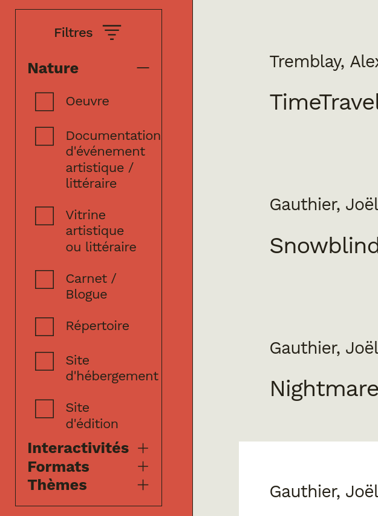

import { Good, Bad } from '@/components/icons/check'
import  AboutMe  from '@/components/aboutMe.mdx'
import { QR } from '@/components/qr'
import { Card } from '@/components/layout/card'
import { Row } from '@/components/layout/row'
import { Col } from '@/components/layout/col'
import { Timer } from './samples/timer/component'
import { Turnstile } from './samples/turnstile/component'
import { Turnstile2 } from './samples/turnstile2/component'
import { Turnstile3 } from './samples/turnstile3/component'
import { TwoColsTbl } from '@/components/layout/two-cols-tbl'
import { RowCode } from '@/components/layout/row-code'
import { ImgBox, TextBox } from '@/components/layout/boxes'
import { Box } from '@/generated/styled-system/jsx'

# State Machines:

## Sometimes a Library, Always a Pattern

_by Juliette Lamarche_

---

<AboutMe />

---

## Scopes

I will start by making a distinction between physical and logical state management. By logical state management, I mean the business logic side of things,
the pure functions which maps one state to another. By physical state management, I mean the actual implementation of that state logic, including concerns such a storage, persistence, scope and
reactivity. Here, I will focus on the logical side of things. Although examples will be in React, the main concepts apply to any front-end framework, to front-end code happening outside the component tree or on the the back-end.

---

## Update by Events vs Updates by Values

- useState vs useReducer
- technically, each can be implemented with the other
- they still capture different intentions

---

## Update by Events vs Updates by Values

### Update by Values

<Row>
  <div>
    - update by sending the next value
    - useState 
    - free transitions, let consumers do whatever they want
    - symmetry between reading and writing  (same type)
    - setter can be a value or an update function 
    - optics 
    - _e.g.:_ form-like, query object
  </div>
  <ImgBox>
    
  </ImgBox>
</Row>

---

## Events vs Values

### Update by Events

<ImgBox>
	
</ImgBox>

---

## Events vs Values

### Update by Events

<Row>
	<div>
		- useReducer, Redux (actions)
    - asymmetry between reading and writing (different types)
    - restricted set of allowed transitions 
    - the same event can have different results depending on the current state
    - state machines
	</div>
	<div>
		```mermaid
    stateDiagram-v2 
      [*] --> green 
      green --> yellow: next 
      yellow --> red: next 
      red --> green: next 
    ```
	</div>
</Row>

---

### Events

- O.G.: [redux](https://redux.js.org/)
- well known
  - React: useReducer, useActionState
  - [Zustand](https://zustand-demo.pmnd.rs/)
  - [Jotai: atomWithReducer](https://jotai.org/docs/utilities/reducer) (don't use `useReducerAtom`)
- great typing
  - [@xstate/store](https://stately.ai/docs/xstate-store)
  - [zustandjs/zustand-xs](https://github.com/zustandjs/zustand-xs)
  - [Constellar: simple state machine](https://prncss-xyz.github.io/constellar/docs/machines/simple-state)

---

## Finite State Machines

### Loader

```typescript
function Loader() {
  const [loading, setLoading] = useState(true)
  const [error, setError] = useState(false)
  // ...
}
```
<Row>
  |             | _loading_ |          |
  | ----------- | :-------: | :------: |
  | **_error_** | *true*    | *false*  |
  | *false*     | <Good />  | <Good /> |
  | *true*      | <Bad />   | <Good /> |
  <Row level={2}>
    <Row level={3}>
      <div>
        **loading**
        ```mermaid
        stateDiagram-v2
          [*] --> true
          true --> false
        ```
      </div>
      <div>
        **error**
        ```mermaid
        stateDiagram-v2
          [*] --> false
          false --> true
        ```
      </div>
    </Row>
    <ImgBox>
      - this part of business logic is expressed in the handlers 
      - you need to inspect all the code to ensure it is enforced
      - would be better to have it near the state description
    </ImgBox>
  </Row>
</Row>

---

## Finite State Machines

### Loader

<RowCode>
  <Col level={2}>
    ```mermaid
    stateDiagram-v2
      [*] --> loading
      loading --> error: error
      loading --> success: success
      error --> [*]
      success --> [*]
    ```
    <div>
      - make illegal states irrepresentable
      - express the succession of events
      - no business logic in the handlers
    </div>
  </Col>
    ```typescript
    !from ./samples/loader/machine.ts
    ```
</RowCode>

---

## Finite State Machines

- replace multiple flags that do not freely combine
- express a succession idea
- regroup business logic
- finite number of possible states
  - exhaustivity
  - visual communication (domain experts)
- think state then event
- domain consistency
- but limited because cannot hold data

---

## Finite State Machines

### Turnstile Gate

<ImgBox>
  
</ImgBox>

---

## Finite State Machines

### Turnstile Gate

<Row>
	```mermaid
  stateDiagram-v2
    [*] --> locked 
    locked --> unlocked: pay 
    unlocked --> locked: push 
  ```
	<Card>
    <Turnstile />
  </Card>
</Row>

---

## Finite State Machines

### Turnstile Gate

<RowCode>
  <div>
  - pure function
  - state then event
    - cohesion (should not accept a payment when you can push the gate)
    - a tool for dealing with human complexity (vs mathematical complexity)
  - state switch
    - has no default case
    - every state type must be handeled
    - exhaustivity
  - event switch 
    - has default case
    - unhandled event type means the event is not triggering a transition
    - extensibility
  </div>
  ```typescript
  !from ./samples/turnstile/machine.ts
  ```
</RowCode>

---

## Finite State Machines

### Turnstile Gate

<Col>
  ```tsx 
  !from ./samples/turnstile/component.tsx 32:32
  ```
  ```tsx 
  !from ./samples/turnstile/component.tsx 36:47
  ```
</Col>


---

## Finite State Machines

### Turnstile Gate

<RowCode>
  <div>
    - simply pass the machine to `useReducer` hook
    - `canPay` has zero knowledge of the transition graph
  </div>
  ```tsx 
  !from ./samples/turnstile/component.tsx 11:29
  ```
</RowCode>

---

## Extended Finite State Machines

- xState context
  - proven to work
  - *but* makes illegal context possible to express
  - do not use type information to its full potential (as a tool for thinking)
- multiple states
  - state type and state payload state are coupled
  - less known

---

## Extended Finite State Machines

### Timer

<Row>
 	```mermaid
   stateDiagram-v2
     [*] --> stopped 
     stopped --> running: toggle 
     stopped --> stopped: reset
     running --> stopped: toggle 
     running --> running: reset
   ```
   <Card>
     <Timer />
   </Card>
</Row>

<div>
  - `reset` is a self-transition
</div>

---

## Extended Finite State Machines

### Timer

<RowCode>
  <div>
    - `elapsed` and `since` have same type but different semantics
    - events have a `now` parameter so reducer can be a pure function
      - easier to test
  </div>
  ```typescript
  !from ./samples/timer/machine.ts
  ```
</RowCode>

---

## Extended Finite State Machines

### Timer

<RowCode>
  <div>
    - we use a function to compute the displayed time
  </div>
  ```typescript
  !from ./samples/timer/count.ts
  ```
</RowCode>

---

## Extended Finite State Machines

### Timer

<RowCode>
  <div>
    - `next` has zero knowledge of the transition graph
  </div>
  ```tsx
  !from ./samples/timer/component.tsx 16:32
  ```
</RowCode>

---

## Extended Finite State Machines

### Timer

<RowCode>
  <div>
    - the `useEffect` hook sends events to the state machine
    - labels
  </div>
  ```tsx
  !from ./samples/timer/component.tsx 34:69
  ```
</RowCode>

---

## Effects

### Turnstile Gate

<Row>
	```mermaid
  stateDiagram-v2
    [*] --> locked 
    locked --> payment: pay 
    payment --> unlocked: success
    payment --> locked: error
    unlocked --> locked: push 
  ```
  <Card>
    <Turnstile2 />
  </Card>
</Row>

<div>
- `payment` state is a meaningful waiting state
- payment implementation is not part of the machine
- `pay` and `push` events are produced by the user
- `sucess` and `error` events are produced by the system
</div>

---

## Effects

### Turnstile Gate

<Row>
  ```typescript
  !from ./samples/turnstile2/machine.ts
  ```
</Row>

---

## Effects

### Turnstile Gate

<Row>
  <div>
    - effect handler calls to `send`
  </div>
  ```tsx 
  !from ./samples/turnstile2/component.tsx 11:42
  ```
</Row>

---

## Messages

### Turnstile Gate

Let's add notification.

<Row>
	```mermaid
  stateDiagram-v2
    [*] --> locked 
    locked --> payment: pay 
    payment --> unlocked: success
    payment --> locked: error
    unlocked --> locked: push 
  ```
  <Card>
    <Turnstile3 />
  </Card>
</Row>

---

## Messages

### Turnstile Gate

<Row>
	```mermaid
  stateDiagram-v2
    classDef junk fill:pink

    [*] --> locked 
    locked --> payment: pay 
    payment --> success: success
    success:::junk --> unlocked: next
    payment --> error: error
    error:::junk --> locked: next
    unlocked --> locked: push 
  ```
	```mermaid
  stateDiagram-v2
    [*] --> locked 
    locked --> payment: pay 
    payment --> unlocked: success
    payment --> locked: error
    unlocked --> locked: push 
  ```
</Row>
<div>
  - `success` and `error` states are **junk states**
  - we will give machine the capability to send messages during transitions
  - effects for two-way communication
  - messages for one-way communication
</div>

---

## Messages

### Turnstile Gate

<Row>
  <div>
    - we define a third type parameter for messages
    - we pass it to our extended reducer
    - we call it during the transition
  </div>
```typescript
!from ./samples/turnstile3/machine.ts
```
</Row>

---

## Messages

### Turnstile Gate

<RowCode>
  <div>
    - we nead a new hook (`useMachine`) because `useReducer` don't allow side effects
    - we will inject the message listener
  </div>
  ```tsx 
  !from ./samples/turnstile3/component.tsx 15:45
  ```
</RowCode>

---

## Messages

### Turnstile Gate

<RowCode>
  <div>
    - implementing message listener
  </div>
  ```tsx 
  !from ./samples/turnstile3/component.tsx 99:112
  ```
</RowCode>

---

## Messages

### Turnstile Gate

<Row>
  <div>
    - binding all the logic into a hook
  </div>
  ```tsx 
  !from ./samples/turnstile3/component.tsx 47:72
  ```
</Row>

---

# State Explosion

  <ImgBox>
    
  </ImgBox>
  <TextBox>
  - as complexity grows, usual clean code concerns araise ("god machine" as "god function" or "god class")
    - multiple responsibilities
    - multiple abstraction levels
  - in a typical application, number of independent state will multiply for each component
    - exponentional growth
  </TextBox>

---

# State Explosion

## Connecting

<TextBox>
- use many machines in one framework
- some machine can have local scopes, other can be global
- have effects or messages connect to another state machine
- xState (actor model)
- useReducer (useContext)
</TextBox>

---

# State Explosion

## Composing

<TextBox>
- statecharts
- composition is a operation that takes simple machines to create a more complex one
- "Harel, D. (1987). A Visual Formalism for Complex Systems. Science of Computer Programming, 231–274".
- was intended to be the entry point of an application
- visual programmation
- xState, Redux
- types of composition
  - product (similar to Redux' slice pattern)
  - hierarchical
  - sum
  - history
</TextBox>

---

# Use Cases

- component logic
  - reusable across frameworks: [Zag](https://zagjs.com/)
- embedded systems
- automata
  - multiple step fetching
  - front-end: out of tree
  - back-end

---

# Library vs Pattern

## Pattern

<Row>
  <div>
  - no learning curve
  - fewer dependencies
  - less descriptive
  </div>
</Row>

---

# Library vs Pattern

## xState

<Row>
  <TextBox>
  - industry standard
  - very good devtools (visual)
  - reactive system is redundant with front-end framework
  - tools for testing (solved a problem they created by not being pure enough)
  - machine have a shared context for all states 
      - vs. a payload that depends on the type of the state
  </TextBox>
  <QR name="XState" href="https://xstate.js.org/" />
</Row>

---

# Library vs Pattern

## Robot

<Row>
  <TextBox>
  - lightweight (1kb)
  - context
  - reactive system is redundant with front-end framework
  </TextBox>
  <QR name="Robot" href="https://thisrobot.life/" />
</Row>

---

# Library vs Pattern

## Constellar

<Row>
  <TextBox>
  - personal project
  - not production ready
  - clear separation of concerns
    - jotai integration
  - multiple state (vs context)
  - optics
  - would love your feedback and your stars (but mostly you feedback)
  - maybe we can make it production ready together!
  </TextBox>
  <QR name="Constellar" href="https://prncss-xyz.github.io/constellar/" />
</Row>

---

## Some Smells

<ImgBox>
  
</ImgBox>

---

## Some Smells

<TwoColsTbl>
| :poop: | :rose: |
|--------------- | --------------- |
| some succession of states should never happen | use a state machine |
| any state leads to any state (the transition graph is saturated) | use a simple state, update by value |
| there is only one state | use a simple reducer function |
| some combination of states should never happen in your application | merge different states (machines or values) into a single machine |
| the machine mixes different concerns or abstraction levels | use multiple machines (connect or compose) |
| the machine has junk states that do not convey useful information | use messages |
</TwoColsTbl>

**Happy Smelling!**

---

# Serialization

- why?
  - persistance
  - transport
  - dev tools
- how
  - serializable core (vs computed state)
  - replay
    - merging decentralized updates
- unreachable states
  - `plusTwo`
  - code smell (make illegal states irrepresentable)


