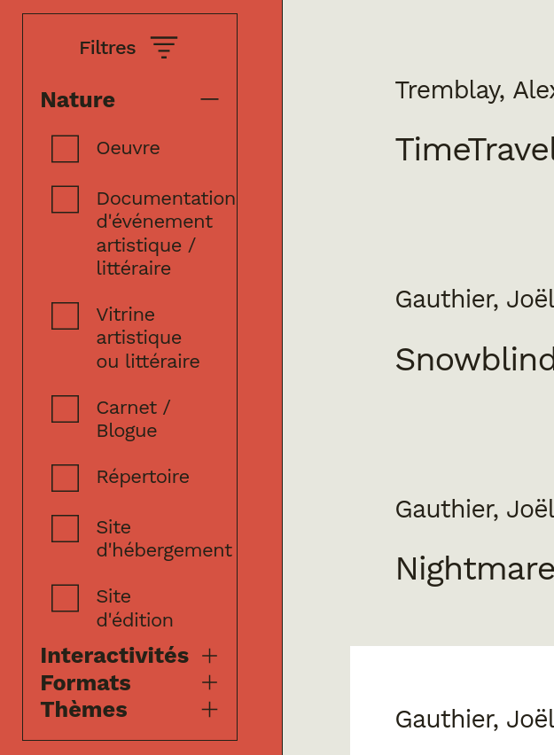
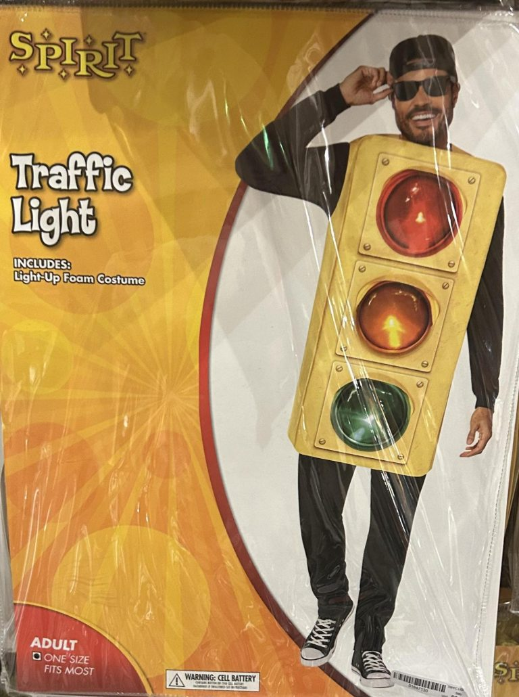

import { Good, Bad } from '@/components/icons/check'
import { QR } from '@/components/qr'
import { Flex, Box, Card } from '@radix-ui/themes'
import { Timer } from './samples/timer/component.tsx'
import { Turnstile } from './samples/turnstile/component.tsx'
import { Turnstile2 } from './samples/turnstile2/component.tsx'

# State Machines:

## Sometimes a Library, Always a Pattern

_by Juliette Lamarche_

---

## State Management vs State Manipulation

- functional core
- separate state logic from reactivity
- testable
- across front-ends and state management libraries
- vs XState
  - own system
  - must be synced with front-end

---

## Update by Events vs Updates by Values

- useState vs useReducer
- technically, each can be implemented with the other
- they still capture different intentions

---

## Update by Events vs Updates by Values

### Update by Values

<Flex gap="6" align="center">
  <Box>
    - useState 
    - free transitions, let consumers do whatever they want
    - symmetry between getters and setters 
    - setter can be a value or an update function 
    - optics 
    - _e.g.:_ form-like, query object
  </Box>
  <Box maxWidth="400px" maxHeight="400px" overflow="hidden">
    b
  </Box>
</Flex>

---

## Events vs Values

### Update by Events

<Box maxWidth="400px" maxHeight="400px">
	
</Box>

---

## Events vs Values

### Update by Events

<Flex gap="6" align="center">
	<Box>
		- useReducer, Redux 
    - asymmetry between reads and writes (different types)
    - restricted set of allowed transitions 
    - result of an event can depend on the current state 
    - states and events have different types 
    - state machines
	</Box>
	<Box maxWidth="400px" maxHeight="400px">
		```mermaid
    stateDiagram-v2 
      [*] --> green 
      green --> yellow: next 
      yellow --> red: next 
      red --> green: next 
    ```
	</Box>
</Flex>

---

## Events vs Values

### What if you use the wrong pattern?

- writing every transition of a free state would be
  - awkward, repetitive, error-prone
  - bad separation of concerns
  - would miss the intention
- handling state machine as a free value would
  - disperse the business logic in the handlers
  - make it harder to trace the source of an update

---

### Events

- O.G.: [redux](https://redux.js.org/)
- well known
  - React: useReducer, useActionState
  - [Zustand](https://zustand-demo.pmnd.rs/)
  - [Jotai: atomWithReducer](https://jotai.org/docs/utilities/reducer) (don't use `useReducerAtom`)
- great typing
  - [@xstate/store](https://stately.ai/docs/xstate-store)
  - [zustandjs/zustand-xs](https://github.com/zustandjs/zustand-xs)
  - [Constellar: simple state machine](https://prncss-xyz.github.io/constellar/docs/machines/simple-state)

---

## Finite State Machines

### Turnstile Gate

<Flex gap="6" align="center">
  <Box maxWidth="400px" maxHeight="400px">
    
  </Box>
	<Card>
    <Box width="120px">
      <Turnstile />
    </Box>
  </Card>
</Flex>

---

## Finite State Machines

### Turnstile Gate

<Flex gap="6" justify="between" align="center">
	<Flex gap="6" direction="column" align="center">
		```mermaid
    stateDiagram-v2
      [*] --> locked 
      locked --> unlocked: pay 
      unlocked --> locked: push 
    ```
    <Box>
    - finite number of possible states
      - exhaustivity
      - visual communication (domain experts)
    - state then event
      - cohesion (should not accept a payment when you can push the gate)
    - no default case (state), default case (event)
    - implementation agnostic
    </Box>
	</Flex>
	<Box maxHeight="80vh" width="100%" overflow="scroll">
```typescript
!from ./samples/turnstile/machine.ts
```
  </Box>
</Flex>

---

## Finite State Machines

### Turnstile Gate

<Flex gap="6" align="center">
	<Box maxWidth="80vw" maxHeight="80vh" overflow="scroll">
    ```tsx 
    !from ./samples/turnstile/component.tsx 7:31
    ```
	</Box>
  <Flex gap="6" direction="column" align="start">
    <Card>
      <Box width="120px">
        <Turnstile />
      </Box>
    </Card>
    <Box>
      - reducer
      - canPay
        - zero knowledge about the state machine
    </Box>
  </Flex>
</Flex>

---

## Finite State Machines

### Turnstile Gate

<Flex gap="6" align="center">
	<Box maxWidth="80vw" maxHeight="80vh" overflow="scroll">
    ```tsx 
    !from ./samples/turnstile/component2.tsx 7:42
    ```
	</Box>
  <Flex gap="6" direction="column" justify="center" align="center">
    <Card>
      <Box width="120px">
        <Turnstile />
      </Box>
    </Card>
    <Box>
      - separate hook
      - export state for sake of visualization
    </Box>
  </Flex>
</Flex>

---

## Finite State Machines

### Loader

```typescript
function Loader() {
  const [loading, setLoading] = useState(true)
  const [error, setError] = useState(false)
  // ...
}
```

<Flex gap="6" align="center">
  |             | _loading_ |          |
  | ----------- | :-------: | :------: |
  | **_error_** | *true*    | *false*  |
  | *false*     | <Good />  | <Good /> |
  | *true*      | <Bad />   | <Good /> |
  <Flex gap="4" >
    <Box>
      **loading**
      ```mermaid
      stateDiagram-v2
        [*] --> true
        true --> false
      ```
    </Box>
    <Box>
      **error**
      ```mermaid
      stateDiagram-v2
        [*] --> false
        false --> true
      ```
    </Box>
  </Flex>
</Flex>

---

## Finite State Machines

### Loader

<Flex gap="6" justify="between" align="center">
  <Flex gap="6" direction="column" align="center">
    ```mermaid
    stateDiagram-v2
      [*] --> loading
      loading --> error: error
      loading --> success: success
      error --> [*]
      success --> [*]
    ```
    <Box>
      - initial/final states
      - make inconsistent states impossible
      - express the succession of events
      - convoluted way of doing nothing
    </Box>
  </Flex>
  <Box maxHeight="80vh" overflow="scroll">
    ```typescript
    !from ./samples/loader/machine.ts
    ```
  </Box>
</Flex>

---

## Finite State Machines

### Loader

<Flex gap="6" justify="between" align="center">
  <Flex gap="6" direction="column" align="center">
    ```mermaid
    stateDiagram-v2
      [*] --> loading
      loading --> error: error
      loading --> success: success
      error --> [*]
      success --> [*]
    ```
    <Box>
      - same semantics
      - more concise
      - less extensible
    </Box>
  </Flex>
  <Box maxHeight="80vh" overflow="scroll">
    ```typescript
    !from ./samples/loader/machine2.ts
    ```
  </Box>
</Flex>

---

## Finite State Machines

- replace multiple flags that do not freely combine
- express a succession idea
- regroup business logic
- think state then event
- exhaustivity
- domain consistency
- visual communication (domain experts)
- but limited because cannot hold information

---

## Extended Finite State Machines

- xState context
  - proven to work
  - makes inconsistent states possible to express
  - do not use type information to its full potential (as a tool for thinking)
- multiple states
  - qualitative and quantitative state are coupled
  - less known

---

## Extended Finite State Machines

### Timer

<Card>
  <Box>
    <Timer />
  </Box>
</Card>

---

## Extended Finite State Machines

### Timer

<Flex gap="6" justify="between" align="center">
	<Flex gap="6" direction="column" align="center">
		```mermaid
    stateDiagram-v2
      [*] --> stopped 
      stopped --> running: toggle 
      stopped --> stopped: reset
      running --> stopped: toggle 
      running --> running: reset
    ```
    <Box>
      - `elapsed` and `since` have same type but different semantics
      - pass `now` to have a pure function
        - testable
        - glitch free
        - in xState, machines have ways to read from environment
    </Box>
	</Flex>
	<Box maxHeight="80vh" overflow="scroll">
    ```typescript
    !from ./samples/timer/machine.ts
    ```
  </Box>
</Flex>

---

## Extended Finite State Machines

### Timer

<Flex gap="6" justify="between" align="center">
	<Flex gap="6" direction="column" align="center">
    <Box>
      - function to compute the displayed time
      - lacks cohesion (a library would solve this)
    </Box>
	</Flex>
	<Box maxHeight="80vh" overflow="scroll">
    ```typescript
    !from ./samples/timer/count.ts
    ```
  </Box>
</Flex>

---

## Extended Finite State Machines

### Timer

<Flex gap="6" justify="between" align="center">
	<Flex gap="6" direction="column" align="center">
    ```tsx
    !from ./samples/timer/component.tsx 8:23
    ```
	</Flex>
  <Flex gap="6" direction="column">
    <Card>
      <Box>
        <Timer />
      </Box>
    </Card>
    <Box>
      - `next` has zero knowledge about the state machine
      - state management could improve rerendering
    </Box>
  </Flex>
</Flex>

---

## Extended Finite State Machines

### Timer

<Flex gap="6" justify="between" align="center">
	<Box maxHeight="80vh" overflow="scroll">
    ```tsx
    !from ./samples/timer/component.tsx 37:63
    ```
	</Box>
  <Flex gap="6" direction="column">
    <Card>
      <Timer />
    </Card>
    <Box>
      - label, i18n
    </Box>
  </Flex>
</Flex>

---

## Extended Finite State Machines

### Library (constellar)

<Flex gap="6" justify="between" align="center">
<Box maxHeight="80vh" overflow="scroll">
  ```typescript
  !from ./samples/ignore/timer-constellar.ts 3:53
  ```
</Box>
<Box maxWidth="300px">
  - objects instead of `switch` statements (type safe)
  - computed values at the same place as events (cohesion)
</Box>
</Flex>

---

## Effects and Messages

### Turnstile Gate

<Flex gap="6" justify="between" align="center">
	<Flex gap="6" direction="column" align="center">
		```mermaid
    stateDiagram-v2
      [*] --> locked 
      locked --> payment: pay 
      payment --> unlocked: success
      payment --> locked: error
      unlocked --> locked: push 
    ```
  <Box>
    - effects (`success` and `error` events)
      - two-way communication
    - messages (choose impurity)
      - one way communication
  </Box>
	</Flex>
	<Box maxHeight="80vh" overflow="scroll">
    ```typescript
    !from ./samples/turnstile2/machine.ts
    ```
  </Box>
</Flex>

---

## Effects and Messages

### Turnstile Gate

<Flex gap="6" align="center">
	<Box maxHeight="80vh" overflow="scroll">
    ```tsx 
    !from ./samples/turnstile2/component.tsx 8:114
    ```
	</Box>
  <Flex gap="6" direction="column" align="start">
    <Card>
      <Box width="255px">
        <Turnstile2 />
      </Box>
    </Card>
    <Box>
      - `useMachine`: 
        - `useReaducer` won't allow side effects
        - messages implementation is injected
      - effects (concurrent rerendering)
        - cached
        - cancelable
        - POST like effects need a dummy time parameter
        - outside react (store, out of tree, back-end)
          - don't need to worry about this
          - have to reimplement an effect system
    </Box>
  </Flex>
</Flex>

---

# State Explosion

<Box py="3">

</Box>

- in a typical application, number of independent state will multiply for each component
- exponentional growth

---

# State Explosion

- use many machines in one framework
- connecting
  - have effects or messages connect to another state machine
  - xState, actor model
- composing, statecharts
  - composition is a operation that takes simple machines to create a more complex one
  - "Harel, D. (1987). A Visual Formalism for Complex Systems. Science of Computer Programming, 231–274".
  - was intended to be the entry point of an application
  - visual programmation
  - xState
  - types of composition
    - product (similar to Redux' slice pattern)
    - sum
    - hierarchical
    - history

---

# Serialization

- why?
  - persistance
  - transport
  - dev tools
-how
  - serializable core (vs computed state)
  - replay
- unreachable states
  - `plusTwo`
  - design smell (make inconsistent states impossible)

---

# Use Cases

- component logic
  - reusable across frameworks: [Zag](https://zagjs.com/)
- speculative: optimistic updates
- embedded systems
- automata
  - multiple step fetching
  - front-end: out of tree
  - back-end

---

# Library vs Pattern

<Flex 
  gap="6" 
  direction="column" 
>
  <Box>
  - patterns
    - no learning curve
    - fewer dependencies
    - less descriptive
  </Box>
  <Box>
  - [XState](https://xstate.js.org/)
    - industry standard
    - very good devtools (visual)
    - tools for testing (solved a problem they created by not being pure enough)
    - complete
    - context
    - reactive system is redundant with front-end framework
  </Box>
</Flex>

---

# Library vs Pattern

<Flex 
  gap="6" 
  direction="column" 
>
  <Box>
  - [Robot](https://thisrobot.life/)
    - lightweight (1kb)
    - context
    - reactive system is redundant with front-end framework
  </Box>
  <Box>
  - [Constellar](https://prncss-xyz.github.io/constellar/)
    - personal project
    - not production ready
    - clear separation of concerns
      - jotai integration
    - multiple state (vs context)
    - optics
    - would love your feedback and your stars (but mostly you feedback)
    - maybe we can make it production ready together!
  </Box>
</Flex>

---

## Juliette Lamarche

### Let's connect

<Flex gap="6" align="center" >
  <Box>
    <QR name="linkedIn" href="https://www.linkedin.com/in/juliette-lamarche-2295a4248/" />
  </Box>
  <Box>
    about me
    - full stack developer
    - self-taught, math background
    - TypeScript, React, FP
    - working on [Constellar](https://prncss-xyz.github.io/constellar/)
    - looking for a job
    - grateful for a review
    - will be speaking at [/dev/mtl](https://www.dev-mtl.ca/)
  </Box>
</Flex>
